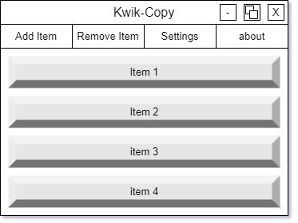
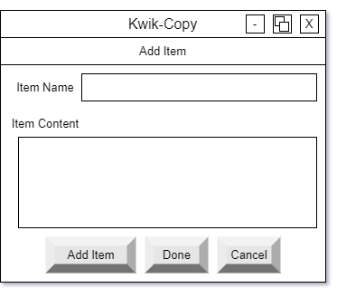
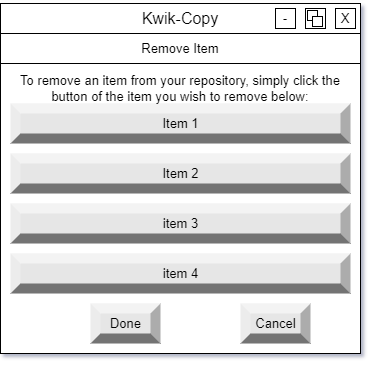
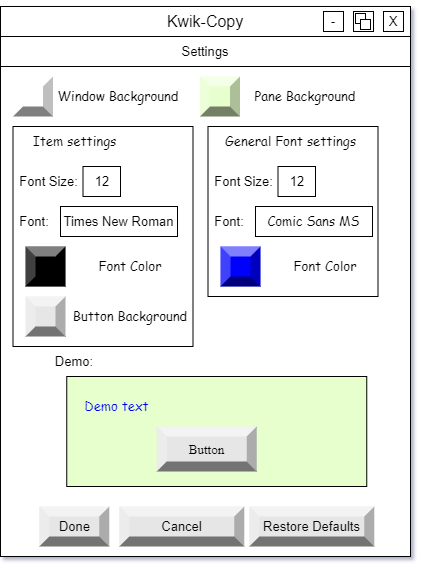

# Quick-Kopy

Purpose: just a little tool to allow myself and others in my office to build and maintain a mini-library of materials an items that we routinely need to paste into different items while providing a simple to use GUI for the purpose.


## Table of Contents

- [Quick-Kopy](#quick-kopy)
  - [Table of Contents](#table-of-contents)
  - [Installation](#installation)
  - [Usage](#usage)
  - [Building](#building-an-executable)

## Installation

1. Download the latest release from the [releases page](releases.md) and unzip it to a location of your choice.
2. Run the `Quick-Kopy.exe` file.

## Usage



when the program first runs, there will be no items in the user repository. You will need to add items. To do this, click the `Add Item` button. This will open a new window where you can enter the name of the item and the text that you want to be copied to the clipboard when the item is selected. Once you have entered the name and text, click the `Add Item` button to add the item to the repository. You can add as many items as you want. When you are done adding items, close the `Add Item` window.



once you have added items to the repository, you can select an item by clicking on it in the list. This will copy the text of the item to the clipboard. You can then paste the text into any other program.

to remove an item from the repository, click on the 'remove item' option in the menu bar. You will be presented with a list of buttons, each button representing an item in the user repository. Simply click the button of the item you wish to remove. When you are done removing items, close the 'Remove item' window.



to change the visual appearance of the program, click on "settings" in the menu tab. This will open a window that will allow you to change the font size, font color, font, window background color, window pane, and button background colors. You can also restore the default program settings by clicking the 'restore defaults' button. When you are done changing the settings, close the 'settings' window. Changes will be applied immediately.



## Building an executable

1. Install Poetry (`pip install poetry`)
2. Install the project dependencies (`poetry install --with dev`)
3. Build; if you'd like to use the provided spec file fr convenience, use this:

    ```sh
    poetry run pyinstaller .\quick_kopy.spec
    ```

    Alternatively, you can build manually:

    ```sh
    poetry run pyinstaller -F -n "Quick-Kopy" --add-data "./quick_kopy/data;./quick_kopy/data" -i "./quick_kopy/data/icon.ico" ./quick_kopy/main.pyw
    ```
